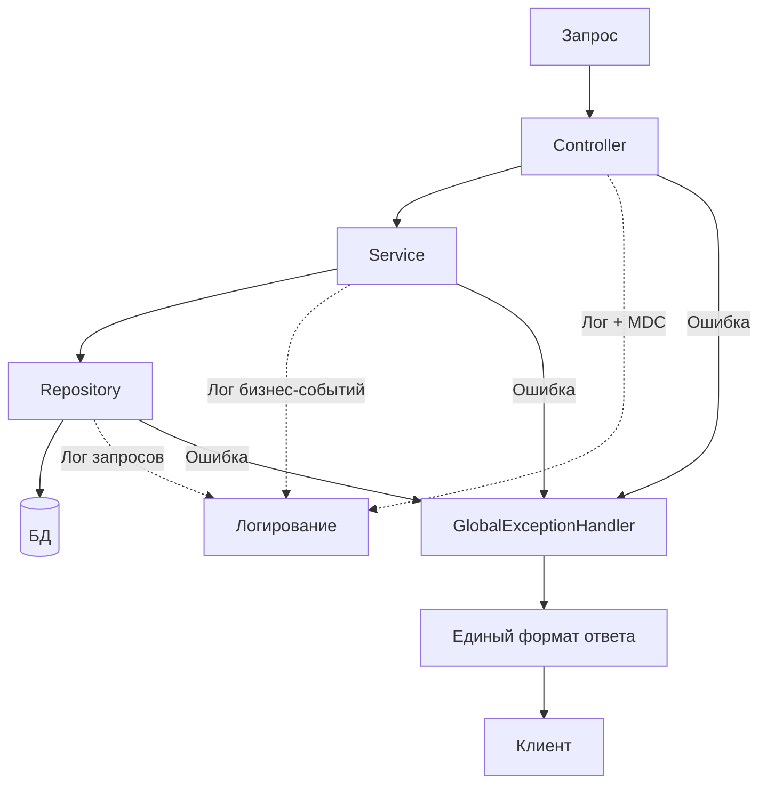

# Логирование и обработка ошибок

## 1. Логирование

### 1.1. Назначение

Логирование нужно для:
- Отладки во время разработки
- Разбора инцидентов после демо
- Аудита действий пользователей
- Диагностики проблем с интеграциями

### 1.2. Что логируем

**Бизнес-события:**
- Создание заявки
- Изменение статуса заявки
- Назначение ответственного на этап
- Решения по согласованиям (согласовано / возвращено / отклонено)
- Завершение этапа
- Закрытие заявки
- Отмена заявки

**События SLA:**
- Назначен дедлайн по этапу
- Приближение дедлайна (25% времени)
- Нарушение дедлайна
- Приостановка SLA
- Возобновление SLA

**События интеграций:**
- Запрос к mock CRM
- Запрос к mock биллингу
- Запрос к mock справочнику
- Ответ внешней системы
- Ошибка внешней системы
- Retry-попытка

**Технические события:**
- Запуск приложения
- Остановка приложения
- Подключение к БД
- Подключение к RabbitMQ
- Отправка уведомления
- Ошибка обработки запроса

### 1.3. Формат лога

`{timestamp} | {level} | {thread} | {logger} | {message} | {context}`

**Пример:**

`2026-10-03 12:00:00.123 | INFO | http-nio-8080-exec-1 | RequestService | Заявка создана | requestId=550e8400, clientId=123e4567, userId=user-1`

`2026-10-03 12:00:05.456 | INFO | http-nio-8080-exec-2 | RoutingEngine | Маршрут построен | requestId=550e8400, stages=[TECH_CHECK, LEGAL, FINANCE]`

`2026-10-03 12:00:10.789 | WARN | sla-scheduler-1 | SlaService | Приближение SLA | requestId=550e8400, stageId=stage-1, timeLeft=PT1H`

`2026-10-03 12:00:15.012 | ERROR | http-nio-8080-exec-3 | CrmClient | Ошибка CRM | requestId=550e8400, status=503, retry=1/3`

### 1.4. Уровни логирования

| Уровень | Когда использовать | Пример |
|---|---|---|
| **TRACE** | Очень детальные данные, обычно выключен | Вызов каждого метода |
| **DEBUG** | Детали для разработки | Значения переменных, шаги алгоритма |
| **INFO** | Обычные бизнес-события | Заявка создана, статус изменён |
| **WARN** | Потенциальная проблема | Приближение SLA, retry интеграции |
| **ERROR** | Ошибка, но система работает | Ошибка внешней системы, невалидные данные |
| **FATAL** | Система не может работать | Не удалось подключиться к БД |

### 1.5. Контекст логирования

В каждый лог добавляется контекст:

| Поле | Описание |
|---|---|
| `requestId` | ID заявки |
| `userId` | Кто выполнил действие |
| `stageId` | ID этапа |
| `traceId` | ID для сквозной трассировки запроса |

MDC (Mapped Diagnostic Context) используется для автоматической подстановки контекста в каждый лог.

### 1.6. Куда пишем

| Окружение | Назначение |
|---|---|
| **Dev** | Консоль + файл `logs/app.log` |
| **Prod** | Файл `logs/app.log` с ротацией |

**Ротация логов:**
- Размер файла: 10 MB
- Храним: 30 дней
- Всего файлов: 10

### 1.7. Что НЕ логируем

- Пароли
- Токены
- Персональные данные клиентов (телефоны, email — маскируем)
- Полные тела запросов с чувствительными данными

## 2. Обработка ошибок

### 2.1. Типы ошибок

| Тип | Пример | HTTP-код |
|---|---|---|
| **Валидация** | Поле `clientId` пустое | 400 Bad Request |
| **Аутентификация** | Токен отсутствует | 401 Unauthorized |
| **Авторизация** | Нет прав на действие | 403 Forbidden |
| **Не найдено** | Заявка не существует | 404 Not Found |
| **Конфликт** | Переход из недопустимого статуса | 409 Conflict |
| **Бизнес-правило** | Скидка больше допустимой | 422 Unprocessable Entity |
| **Внутренняя ошибка** | NPE, ошибка БД | 500 Internal Server Error |
| **Внешняя система** | Mock CRM недоступен | 502 Bad Gateway |
| **Недоступность сервиса** | БД не отвечает | 503 Service Unavailable |

### 2.2. Формат ответа об ошибке

{
  "timestamp": "2026-10-03T12:00:00Z",
  "status": 400,
  "error": "Bad Request",
  "message": "Поле 'clientId' обязательно",
  "path": "/api/requests",
  "traceId": "abc-123-def"
}

### 2.3. Обработка ошибок валидации

Ошибки валидации собираются в список:

{
  "timestamp": "2026-10-03T12:00:00Z",
  "status": 400,
  "error": "Validation Failed",
  "errors": [
    { "field": "clientId", "message": "обязательное поле" },
    { "field": "address", "message": "адрес слишком длинный" }
  ],
  "path": "/api/requests"
}

### 2.4. Обработка ошибок внешних систем

**Стратегия:**
1. **Таймаут** — 5 секунд на запрос
2. **Retry** — 3 попытки с экспоненциальной задержкой (1s, 2s, 4s)
3. **Circuit Breaker** — после 5 подряд ошибок временно прекращаем вызовы
4. **Fallback** — если система недоступна, заявка переводится в `ON_HOLD`
5. **Логирование** — все ошибки логируются с уровнем `ERROR`
6. **Уведомление** — оператор получает уведомление о проблеме

**Пример обработки:**

1. Запрос к CRM → таймаут
2. Retry #1 → ошибка 503
3. Retry #2 → ошибка 503
4. Retry #3 → ошибка 503
5. Fallback: заявка → ON_HOLD
6. Лог: ERROR, "CRM недоступен после 3 попыток"
7. Уведомление оператору

### 2.5. Обработка ошибок бизнес-логики

**Примеры:**
- Попытка согласовать этап, который уже согласован → 409 Conflict
- Попытка перевести заявку в недопустимый статус → 409 Conflict
- Скидка больше допустимой → 422 Unprocessable Entity
- Попытка действия без прав → 403 Forbidden

**Каждая ошибка логируется:**

ERROR | BusinessException | Переход невозможен | requestId=..., from=APPROVED, to=DRAFT, userId=...

### 2.6. Обработка ошибок БД

- **Ошибка подключения** → 503, лог FATAL, retry подключения
- **Нарушение уникальности** → 409, лог WARN
- **Нарушение FK** → 400, лог WARN
- **Ошибка транзакции** → 500, лог ERROR, rollback

### 2.7. Глобальный обработчик ошибок

Все ошибки проходят через `@RestControllerAdvice`:

- Ловит все исключения
- Преобразует в единый формат ответа
- Логирует с нужным уровнем
- Не отдаёт клиенту внутренние детали (stack trace)

### 2.8. Что НЕ отдаём клиенту

- Stack trace
- Названия классов и методов
- SQL-запросы
- Детали внутренней реализации
- Пароли, токены

**Отдаём:** статус, понятное сообщение, traceId для поддержки.

## 3. Мониторинг (при развитии)

На текущем этапе не требуется. При развитии проекта можно добавить:

- **Grafana + Prometheus** — метрики
- **ELK Stack** — централизованные логи
- **Sentry** — трекинг ошибок
- **Health checks** — `/actuator/health`

### 4. Итоговая схема

